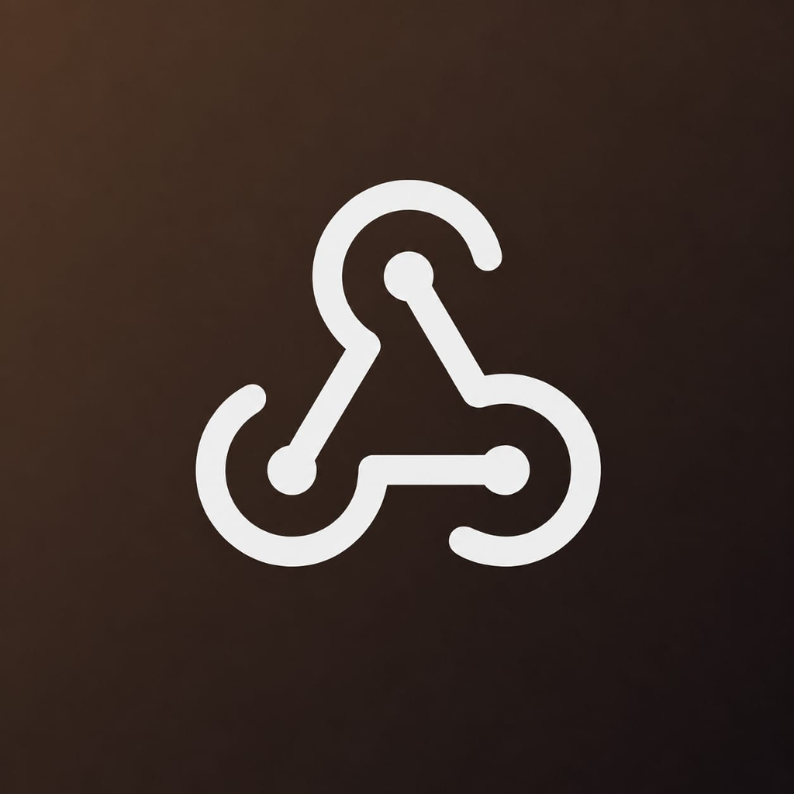
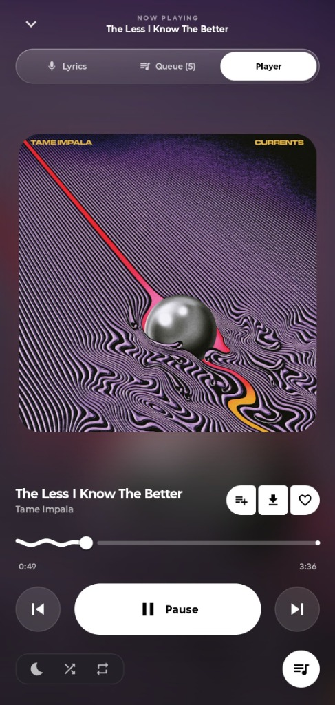
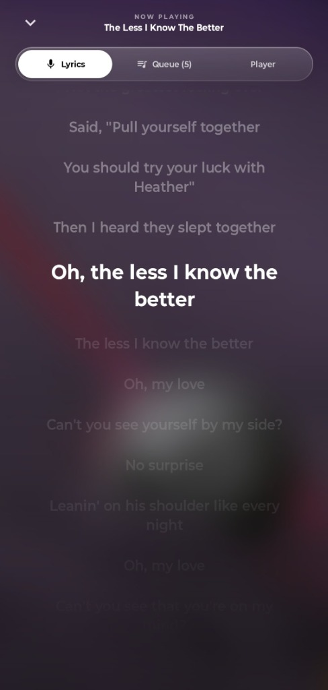
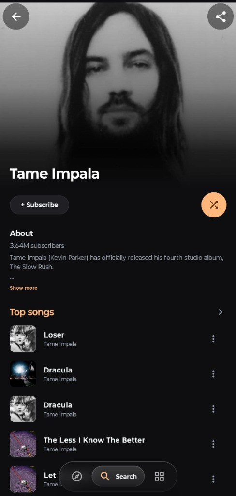
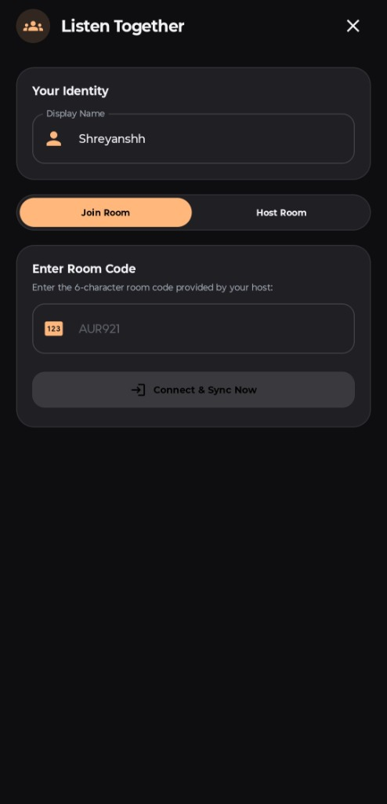
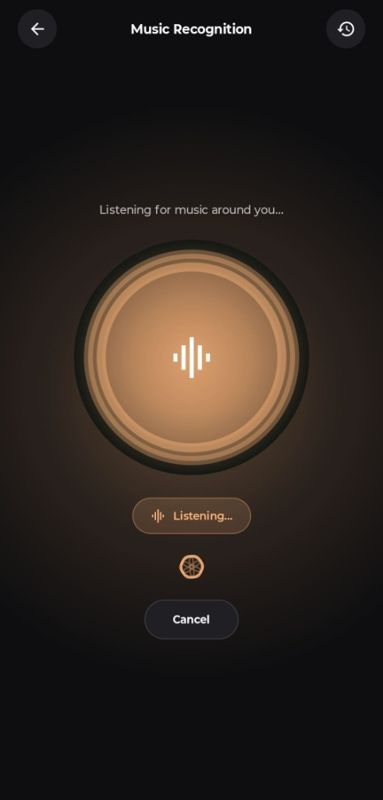
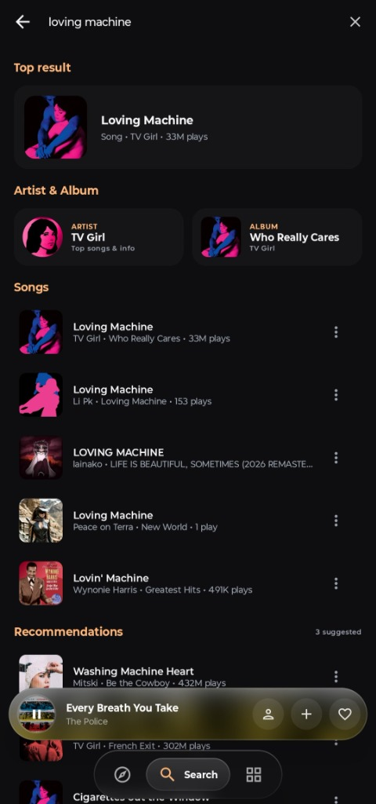
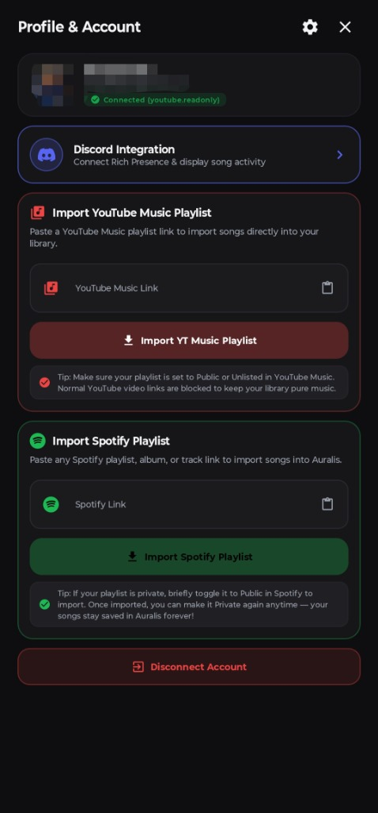
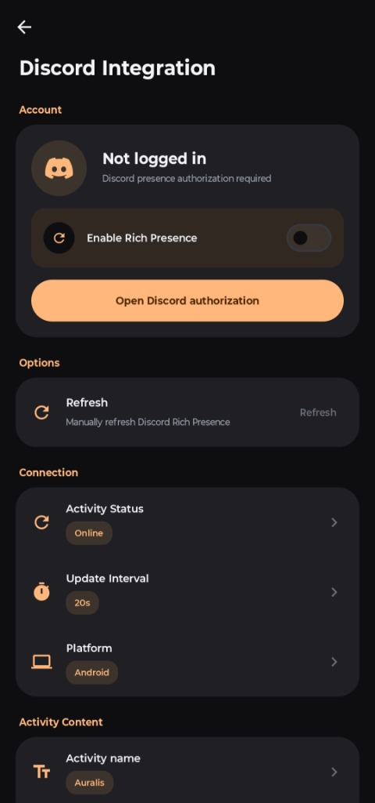

<div align="center">
  
  <h1>Auralis</h1>
  <p><b>Next-Generation Native Music Streaming & Collaborative Group Listening</b></p>

  
  
  
  
  
  [](https://www.buymeachai.in/shreyanshh071)

  <br />

  **Auralis** is a modern, high-performance, ad-free native music streaming and collaborative listening experience crafted with **Jetpack Compose**, **AndroidX Media3**, **Kotlin Coroutines**, and **Material 3**.

  <br />

  [Download APK](https://github.com/shreyanshchoubey09/Auralis/releases/latest) • [Screenshots](#-screenshots) • [Features](#-features) • [Tech Stack](#%EF%B8%8F-architecture--tech-stack) • [Sponsor](#-sponsor-this-project)

</div>

> [!WARNING]
> **Regional Restriction** — If YouTube Music is unavailable in your region, this app will not work without a VPN or proxy connecting to a supported region.

---

## 📸 Screenshots

<div align="center">
  <table>
    <tr>
      <td align="center" width="25%">
        <br />
        <sub><b>Now Playing</b></sub>
      </td>
      <td align="center" width="25%">
        <br />
        <sub><b>Synced Karaoke Lyrics</b></sub>
      </td>
      <td align="center" width="25%">
        <br />
        <sub><b>Artist Discography</b></sub>
      </td>
      <td align="center" width="25%">
        <br />
        <sub><b>Listen Together</b></sub>
      </td>
    </tr>
    <tr>
      <td align="center" width="25%">
        <br />
        <sub><b>Music Recognition</b></sub>
      </td>
      <td align="center" width="25%">
        <br />
        <sub><b>Search & Discovery</b></sub>
      </td>
      <td align="center" width="25%">
        <br />
        <sub><b>Playlist Importers</b></sub>
      </td>
      <td align="center" width="25%">
        <br />
        <sub><b>Discord Presence</b></sub>
      </td>
    </tr>
  </table>
</div>

---

## ✨ Features

### 🌐 Listen Together (Real-Time Group Listening)
- **Synchronized Playback Rooms**: Listen to tracks simultaneously with friends in real time (<50ms sync latency) powered by Firebase Firestore and dynamic drift calculation.
- **Dedicated Host Controls & Listener Protection**: Prevents accidental desync by blocking listener playback alterations from Bluetooth earphones, TWS touch gestures, or lockscreen controls while keeping volume independent.
- **Smart Song Recommendations & Voting**: Room members can search, recommend, and upvote songs in a shared room queue.
- **Real-Time Member Presence & Pill Alerts**: Instant floating animated notifications when friends join, leave, or disconnect.

### 🎨 Visual Excellence & Modern Aesthetics
- **Dynamic Blurred Artwork Player**: Fluid multi-layer ambient background that adapts seamlessly to the playing song's artwork palette.
- **Glassmorphic Floating Sheets & Controls**: Ultra-premium Frosted Glass / Haze effect across player sheets, dialogs, and popups.
- **Fluid Spring Animations & 120 FPS Scrolling**: Zero-lag scrolling performance with optimized artwork caching and lightweight list item bindings.
- **Verified Studio Artworks & Portrait Fallback**: High-resolution studio album covers (`=w1200-h1200`) and automatic Wikipedia portrait resolution for artists with blank avatars (e.g. Kanye West).

### 📜 Multi-Engine Synced Lyrics Ecosystem
- **5-Tier Lyrics Integration**: Real-time karaoke-style line-by-line and word-by-word synced lyrics from **Musixmatch** (Spotify catalog), **LRCLIB**, **KuGou** (200M+ synchronized catalog), **AMLL**, and official **YouTube Music** record-label lyrics.
- **AI Translation & Romanization**: One-tap AI translation to English and Pinyin/Romaji/Hangul transliteration for foreign language tracks.
- **Spotify-Style Lyric Card Sharing**: Generate and export customizable aesthetic lyric cards directly to social media.
- **Offline Caching**: Automatically saves fetched synchronized lyrics for instant offline access.

### 🎧 Audiophile-Grade Playback Engine
- **Uninterrupted Background Streaming**: Rock-solid playback with `PARTIAL_WAKE_LOCK`, `WifiLock`, and native foreground `MediaSessionService` that never sleeps.
- **Android 13/14 Quick Settings & Lock-Screen Deck**: Native system media card featuring monochrome app badge, interactive scrub seekbar, previous/next controls, like/heart toggle, and repeat modes.
- **Offline Downloads & Local Library**: Download tracks directly to local storage for offline playback with high-fidelity audio options.
- **Spatial Audio & Custom Equalizer**: Fine-tune your soundstage with built-in spatialization, pitch, and playback speed adjustments.

### 🔍 Discovery, Search & Music Recognition
- **Instant Search & Autocomplete**: Lightning-fast search suggestions across songs, albums, artists, and playlists with parallel query filtering.
- **Music & Voice Recognition**: Identify songs playing around you using built-in acoustic fingerprinting (Shazam / ACRCloud / SongRec).
- **Taste Profiler & Speed Dial**: Personalized home feed tailored to your real listening habits, heavy rotation, and top-played artists.
- **Full Artist Discography**: Artist bios, monthly listener counts, top tracks, albums, singles, and related artist graphs.

### ☁️ Cloud Sync & Playlist Importer
- **One-Click Playlist Import**: Effortlessly import playlists from Spotify and YouTube directly into your library.
- **Google Account & Firebase Sync**: Sync your favorites, custom playlists, and listening history securely across devices.

### 🔄 In-App Direct OTA Updater
- **Instant Update Notifications**: Checks GitHub Releases automatically and notifies you of new versions.
- **In-App Background Download & Install**: Download APK updates with a live progress bar and install seamlessly with one tap.

---

## 🛠️ Architecture & Tech Stack

| Layer | Technologies |
| :--- | :--- |
| **UI & Presentation** | [Jetpack Compose](https://developer.android.com/jetpack/compose), [Material 3](https://m3.material.io/), [Haze Blur](https://github.com/chrisbanes/haze), [Coil 2.6](https://coil-kt.github.io/coil/) |
| **Audio Engine** | [AndroidX Media3](https://developer.android.com/media/media3) (`ExoPlayer`, `MediaSessionService`, `ForwardingPlayer`), `AudioTrack` |
| **Concurrency & Reactive** | [Kotlin Coroutines](https://kotlinlang.org/docs/coroutines-overview.html), [StateFlow & SharedFlow](https://developer.android.com/kotlin/flow) |
| **Local Persistence** | [Room Database](https://developer.android.com/training/data-storage/room) (`AuralisDatabase`), [AndroidX DataStore](https://developer.android.com/topic/libraries/architecture/datastore) |
| **Networking & Extraction** | [OkHttp 4](https://square.github.io/okhttp/), Custom InnerTube Web Client, NewPipe Extractor |
| **Backend & Sync** | [Firebase Auth](https://firebase.google.com/products/auth), [Cloud Firestore](https://firebase.google.com/products/firestore), Google Sign-In |
| **Lyrics Providers** | Musixmatch, LRCLIB, KuGou, AMLL, YouTube Music |

---

## 📂 Project Structure

```
Auralis/
├── android/
│   ├── app/
│   │   ├── src/main/
│   │   │   ├── java/com/auralis/music/
│   │   │   │   ├── data/
│   │   │   │   │   ├── datastore/      # Preferences & Settings DataStore
│   │   │   │   │   ├── download/       # Offline Audio Download Manager
│   │   │   │   │   ├── local/          # Room DB, DAOs, Entities
│   │   │   │   │   ├── network/        # InnerTubeClient, LyricsClient, Spotify/YT Importers
│   │   │   │   │   ├── parser/         # LRC & TTML timestamp parsers, LyricsMatcher
│   │   │   │   │   ├── repository/     # Repository implementations
│   │   │   │   │   ├── service/        # AuralisAudioPlayer, YouTubeAudioEngine
│   │   │   │   │   └── sync/           # ListenTogetherManager & Math Engine
│   │   │   │   ├── domain/             # Domain Models, Auth & Interfaces
│   │   │   │   ├── service/            # AuralisMediaService (Media3 Session & Deck)
│   │   │   │   ├── ui/                 # Jetpack Compose UI
│   │   │   │   │   ├── components/     # Reusable UI Cards, Modals, Pills
│   │   │   │   │   ├── home/           # HomeScreen, SpeedDial & Sections
│   │   │   │   │   ├── explore/        # Search & Explore screens
│   │   │   │   │   ├── library/        # Playlists, Downloads & History
│   │   │   │   │   ├── lyrics/         # Synced Lyrics & Lyric Card Creator
│   │   │   │   │   ├── player/         # MiniPlayer & NowPlaying Fullscreen Modal
│   │   │   │   │   ├── screens/        # ArtistScreen, Settings & Sub-views
│   │   │   │   │   └── viewmodel/      # Architecture ViewModels
│   │   │   │   └── MainActivity.kt     # Main Android Entry Point
│   │   │   └── res/                    # Drawables, icons, layout values
│   │   └── build.gradle.kts
│   └── build.gradle.kts
├── .github/
│   └── FUNDING.yml                     # Sponsor Configuration
└── README.md
```

---

## 💖 Sponsor This Project

If you love using **Auralis** and want to support its ongoing development:

[](https://www.buymeachai.in/shreyanshh071)

Your support helps keep the project fast, 100% ad-free, open-source, and constantly improving!

---

## 📄 License

This project is open-source under the [MIT License](LICENSE).
