<div align="center">
  
  <h1>Auralis</h1>
  <p><b>A native YouTube Music player for Android, with synced lyrics and group listening</b></p>

  
  -32CD32?style=for-the-badge&logo=android&logoColor=white)
  
  
  
  
  [](https://www.buymeachai.in/shreyanshh071)

  <br />

  **Auralis** is an ad-free music player for Android that streams from YouTube Music, built natively with **Jetpack Compose**, **AndroidX Media3**, **Kotlin Coroutines** and **Material 3**.

  <br />

  [Website](https://auralis-self-nu.vercel.app) • [Download APK](https://github.com/Shreyanshh071/Auralis/releases/latest) • [Screenshots](#-screenshots) • [What's New](#-whats-new-in-111) • [Features](#-features) • [FAQ](#-frequently-asked-questions-faq) • [Tech Stack](#%EF%B8%8F-architecture--tech-stack) • [Sponsor](#-sponsor-this-project)

</div>

> [!WARNING]
> **Regional Restriction** — If YouTube Music is unavailable in your region, this app will not work without a VPN or proxy connecting to a supported region.

---

## 🆕 What's New in 1.1.1

- **More reliable karaoke lyrics** — word highlighting sweeps smoothly through shaped text and completes each sung word.
- **Better search results** — songs and albums with the same name stay distinct, rank by available play counts, and no longer repeat beneath the top cards.
- **Safer playlist imports** — YouTube Shorts are filtered out, and imported playlists cannot replace a local playlist just because their names match.
- **Your playlists in Speed Dial** — a playlist appears after at least three listening sessions and 20 minutes of playback.

[Download the universal APK](https://github.com/Shreyanshh071/Auralis/releases/latest) for Android 7.0 and newer.

## What's New in 1.1.0

The biggest update so far. [Full release notes →](https://github.com/Shreyanshh071/Auralis/releases/tag/v1.1.0)

- **Stats that follow your account** — listening stats are backed up when you're signed in and come back after a reinstall or on a new phone.
- **Offline song cache** — songs you play are kept on your phone (you choose the size), so replays don't download again and work without internet.
- **Smarter search** — when an album and a song share a name, the more-played one is the Top result and the other shows right below under **Also matching**.
- **Rebuilt Listen Together** — hosts decide who can play, skip or seek; everyone starts each song together; optional Allow / Decline for guests' picks.
- **Word-by-word lyrics** — smoother karaoke highlighting, Hinglish for Indian songs, and no more highlight running ahead after you tap a line.
- **Smoother everywhere** — no blank flash on launch, Home opens with artwork ready, sections unfold into place, and a new wavy volume dial.
- **Remove from queue**, a **Discord profile** in Discord Integration, and dozens of fixes.

### 📦 One universal APK (~25 MB)
There's one APK and it runs on every Android phone, whatever processor it has (`arm64-v8a`, `armeabi-v7a`, `x86`, `x86_64`). Most of its size is Discord's official SDK for Rich Presence, which includes native code for each of those processor types. The app itself is native Jetpack Compose, shrunk with R8.

---

## 📸 Screenshots

<div align="center">
  <table>
    <tr>
      <td align="center" width="25%">
        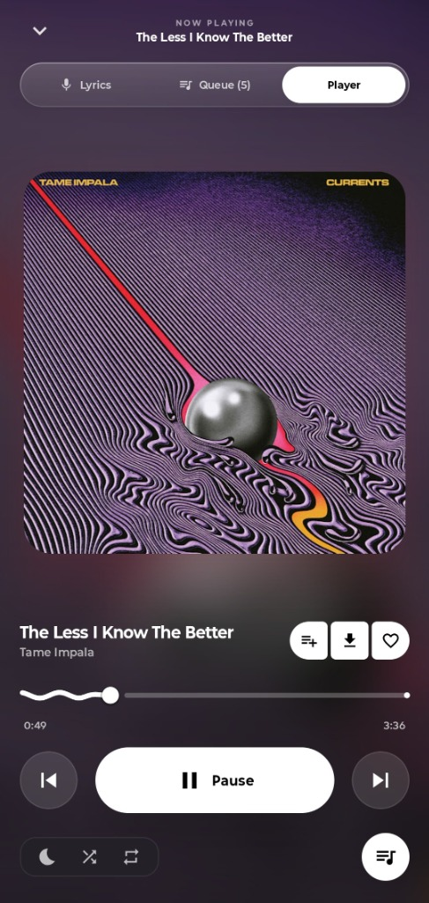<br />
        <sub><b>Now Playing</b></sub>
      </td>
      <td align="center" width="25%">
        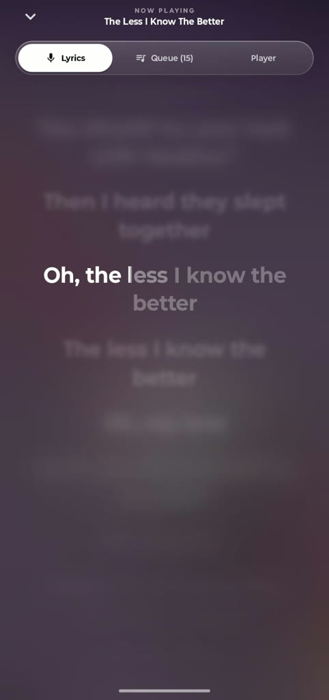<br />
        <sub><b>Synced Karaoke Lyrics</b></sub>
      </td>
      <td align="center" width="25%">
        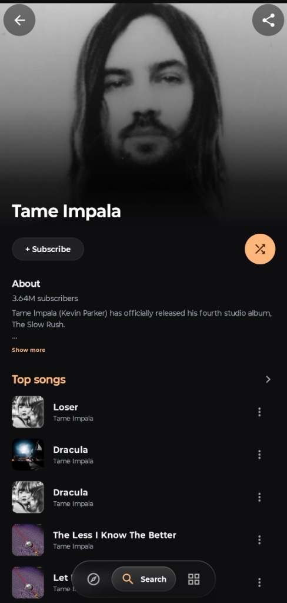<br />
        <sub><b>Artist Discography</b></sub>
      </td>
      <td align="center" width="25%">
        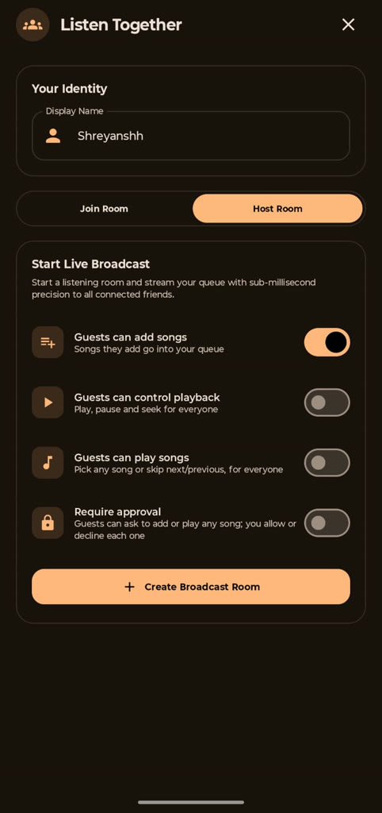<br />
        <sub><b>Listen Together</b></sub>
      </td>
    </tr>
    <tr>
      <td align="center" width="25%">
        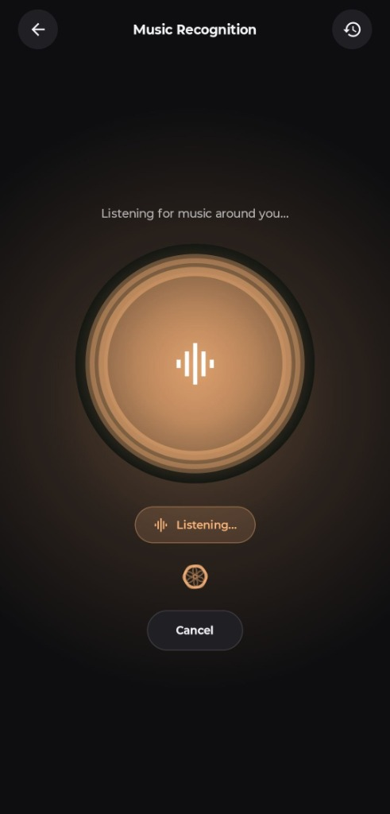<br />
        <sub><b>Music Recognition</b></sub>
      </td>
      <td align="center" width="25%">
        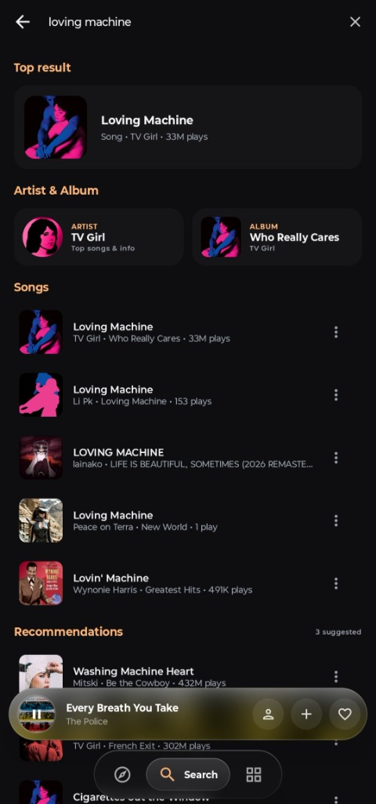<br />
        <sub><b>Search & Discovery</b></sub>
      </td>
      <td align="center" width="25%">
        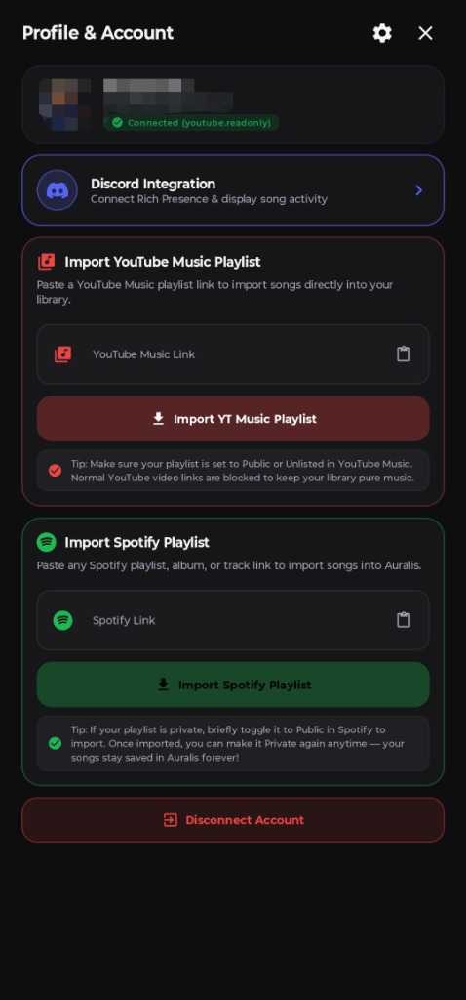<br />
        <sub><b>Playlist Importers</b></sub>
      </td>
      <td align="center" width="25%">
        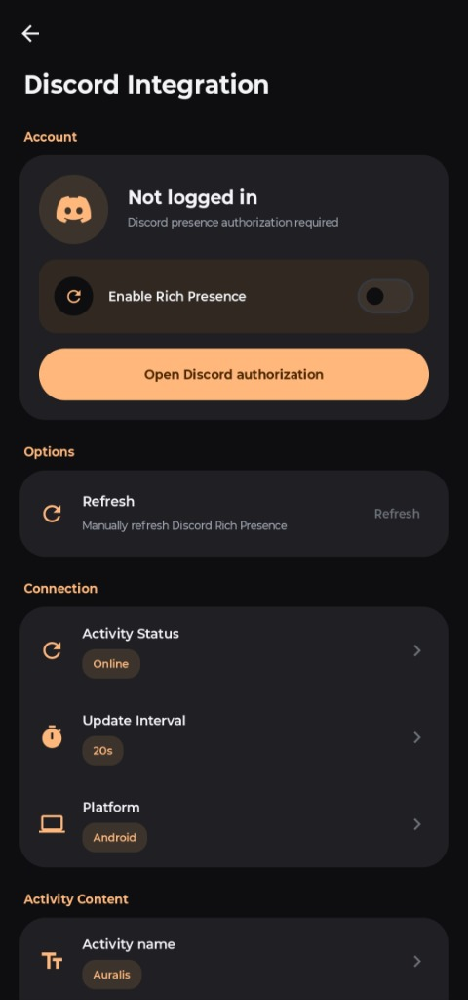<br />
        <sub><b>Discord Presence</b></sub>
      </td>
    </tr>
    <tr>
      <td align="center" width="25%">
        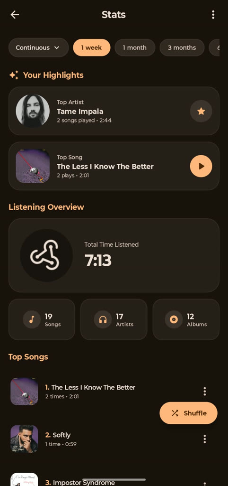<br />
        <sub><b>Listening Stats</b></sub>
      </td>
      <td align="center" width="25%">
        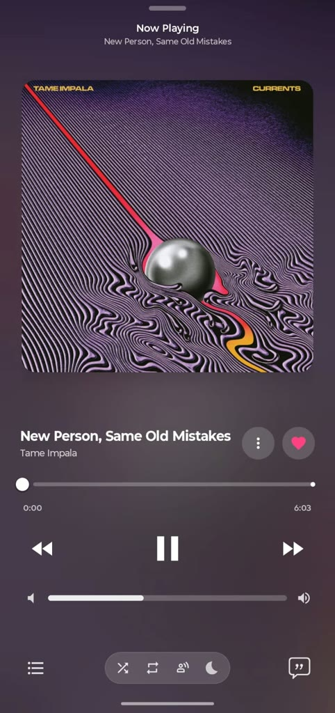<br />
        <sub><b>New Player</b></sub>
      </td>
      <td align="center" width="25%">
        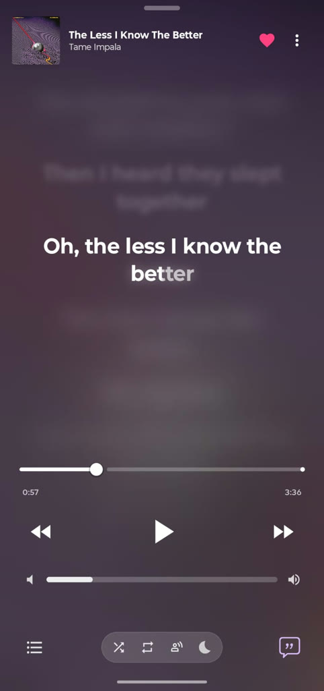<br />
        <sub><b>Player · Lyrics</b></sub>
      </td>
      <td align="center" width="25%">
        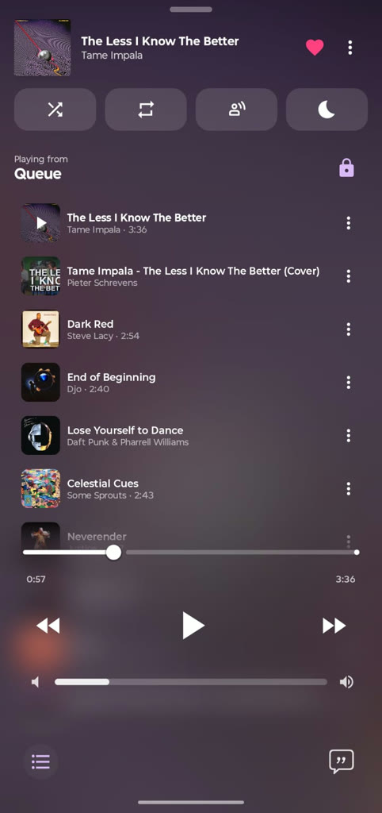<br />
        <sub><b>Player · Queue</b></sub>
      </td>
    </tr>
  </table>
</div>

---

## ✨ Features

### 🌐 Listen Together (Real-Time Group Listening)
- **Synchronized Playback Rooms**: Join with a 6-character code and listen together in real time. The host holds each new song until everyone has it loaded, so all of you start together.
- **Host Permissions**: Choose whether guests may control playback (play, pause, seek) and whether they may play or skip songs, with optional Allow / Decline approval for their picks.
- **Dedicated Host Controls & Listener Protection**: Prevents accidental desync by blocking listener playback alterations from Bluetooth earphones, TWS touch gestures, or lockscreen controls while keeping volume independent.
- **Smart Song Recommendations & Voting**: Room members can search, recommend, and upvote songs in a shared room queue.
- **Member Presence Alerts**: A small notification when friends join, leave or disconnect.

### 🎨 Visual Excellence & Modern Aesthetics
- **Artwork-Coloured Player**: The player background takes its colours from the current song's artwork.
- **Frosted-Glass Sheets & Controls**: A blurred glass effect (Haze) on player sheets, dialogs and popups.
- **Spring Animations & High Refresh Rate**: Spring-based motion throughout, with support for 90/120 Hz displays and cached artwork for smooth scrolling.
- **High-Resolution Artwork & Artist Photos**: Album covers up to 1200×1200, with Wikipedia photos filled in for artists who have no picture (e.g. Kanye West).

### 📜 Multi-Engine Synced Lyrics Ecosystem
- **Word-by-Word Karaoke Lyrics**: Lyrics light up word by word as the song plays; Hindi/Urdu songs always show in Hinglish (Latin letters).
- **Multi-Source Lyrics**: Line-by-line and word-by-word synced lyrics from **Musixmatch** (Spotify catalog), **LRCLIB**, **KuGou** (200M+ synchronized catalog), **AMLL**, and official **YouTube Music** record-label lyrics.
- **AI Translation & Romanization**: One-tap AI translation to English and Pinyin/Romaji/Hangul transliteration for foreign language tracks.
- **Spotify-Style Lyric Card Sharing**: Generate and export customizable aesthetic lyric cards directly to social media.
- **Offline Caching**: Lyrics are saved once fetched, so they're available offline.

### 🎧 Playback
- **Background Playback**: Keeps playing with the screen off, using a foreground `MediaSessionService` with wake and Wi-Fi locks.
- **Android 13/14 Quick Settings & Lock-Screen Deck**: Native system media card featuring monochrome app badge, interactive scrub seekbar, previous/next controls, like/heart toggle, and repeat modes.
- **Offline Song Cache**: Songs you play are kept on your phone up to a size you choose, so replays don't download again and work offline.
- **Offline Downloads & Local Library**: Download songs and whole playlists for offline playback, with Auto / High / Low audio quality (High is Opus up to ~160 kbps).
- **Gapless Playback & Spatial Audio**: The next song is preloaded for gapless transitions, and a Spatial Audio switch widens the soundstage.

### 🔍 Discovery, Search & Music Recognition
- **Search & Autocomplete**: Suggestions as you type, across songs, albums, artists and playlists.
- **Ranked by Plays**: Exact titles first, then everything by popularity. An album and a song with the same name are weighed against each other and the runner-up appears under **Also matching**.
- **Right Album, Every Time**: "View album" opens a song's original album, not a greatest-hits compilation, and standalone singles are labelled as singles.
- **Music & Voice Recognition**: Identify songs playing around you using built-in acoustic fingerprinting (Shazam-compatible, via SongRec).
- **Taste Profiler & Speed Dial**: Personalized home feed tailored to your real listening habits, heavy rotation, and top-played artists.
- **Full Artist Discography**: Artist bios, subscriber counts, top tracks, albums, singles, and related artist graphs.

### ☁️ Cloud Sync & Playlist Importer
- **Playlist Import**: Paste a public Spotify or YouTube playlist link to add it to your library.
- **Google Account & Firebase Sync**: Back up your liked songs, playlists, saved artists and listening stats; sign in on a new phone and they all come back.

### 📊 Listening Stats
- **Real Listening Time**: Only what you actually heard counts; skips don't add a whole song.
- **Top Songs & Artists**: Weekly, monthly and yearly views, with one song counted once even when it's uploaded several times on YouTube.

### 🎮 Discord Rich Presence
- **Show What You're Playing**: Song, artist, album art and progress on your Discord profile via Discord's official Social SDK.
- **Fully Customizable**: Activity name, details, images, status and update interval; seeking updates Discord right away.

### 🔄 In-App Direct OTA Updater
- **Update Notifications**: Checks GitHub Releases and tells you when a new version is out.
- **In-App Background Download & Install**: Download APK updates with a progress bar and install them with one tap.

---

## 🛠️ Architecture & Tech Stack

| Layer | Technologies |
| :--- | :--- |
| **UI & Presentation** | [Jetpack Compose](https://developer.android.com/jetpack/compose), [Material 3](https://m3.material.io/), [Haze Blur](https://github.com/chrisbanes/haze), [Coil 2.7](https://coil-kt.github.io/coil/) |
| **Audio Engine** | [AndroidX Media3](https://developer.android.com/media/media3) (`ExoPlayer`, `MediaSessionService`, `ForwardingPlayer`), `AudioTrack` |
| **Concurrency & Reactive** | [Kotlin Coroutines](https://kotlinlang.org/docs/coroutines-overview.html), [StateFlow & SharedFlow](https://developer.android.com/kotlin/flow) |
| **Local Persistence** | [Room Database](https://developer.android.com/training/data-storage/room) (`AuralisDatabase`), [AndroidX DataStore](https://developer.android.com/topic/libraries/architecture/datastore) |
| **Networking & Extraction** | [OkHttp 4](https://square.github.io/okhttp/), Custom InnerTube Web Client, NewPipe Extractor |
| **Backend & Sync** | [Firebase Auth](https://firebase.google.com/products/auth), [Cloud Firestore](https://firebase.google.com/products/firestore), Google Sign-In |
| **Discord** | [Discord Social SDK](https://discord.com/developers/docs/discord-social-sdk/overview) (Rich Presence) |
| **Lyrics Providers** | Musixmatch, LRCLIB, KuGou, AMLL, YouTube Music |

---

## 📂 Project Structure

```
Auralis/
├── android/
│   ├── app/
│   │   ├── src/main/
│   │   │   ├── java/com/auralis/music/
│   │   │   │   ├── data/
│   │   │   │   │   ├── datastore/      # Preferences & Settings DataStore
│   │   │   │   │   ├── download/       # Offline Audio Download Manager
│   │   │   │   │   ├── local/          # Room DB, DAOs, Entities
│   │   │   │   │   ├── network/        # InnerTubeClient, LyricsClient, Spotify/YT Importers
│   │   │   │   │   ├── parser/         # LRC & TTML timestamp parsers, LyricsMatcher
│   │   │   │   │   ├── repository/     # Repository implementations
│   │   │   │   │   ├── service/        # AuralisAudioPlayer, YouTubeAudioEngine
│   │   │   │   │   └── sync/           # ListenTogetherManager & Math Engine
│   │   │   │   ├── domain/             # Domain Models, Auth & Interfaces
│   │   │   │   ├── service/            # AuralisMediaService (Media3 Session & Deck)
│   │   │   │   ├── ui/                 # Jetpack Compose UI
│   │   │   │   │   ├── components/     # Reusable UI Cards, Modals, Pills
│   │   │   │   │   ├── home/           # HomeScreen, SpeedDial & Sections
│   │   │   │   │   ├── explore/        # Search & Explore screens
│   │   │   │   │   ├── library/        # Playlists, Downloads & History
│   │   │   │   │   ├── lyrics/         # Synced Lyrics & Lyric Card Creator
│   │   │   │   │   ├── player/         # MiniPlayer & NowPlaying Fullscreen Modal
│   │   │   │   │   ├── screens/        # ArtistScreen, Settings & Sub-views
│   │   │   │   │   └── viewmodel/      # Architecture ViewModels
│   │   │   │   └── MainActivity.kt     # Main Android Entry Point
│   │   │   └── res/                    # Drawables, icons, layout values
│   │   └── build.gradle.kts
│   └── build.gradle.kts
├── .github/
│   └── FUNDING.yml                     # Sponsor Configuration
└── README.md
```

---

## ❓ Frequently Asked Questions (FAQ)

<details>
<summary><b>Why is the APK about 25 MB?</b></summary>
<br>

The app itself is small: native **Jetpack Compose** and **AndroidX Media3**, shrunk with **R8**. Most of the download is Discord's official SDK for Rich Presence, which ships native code for every kind of Android processor. That's what lets a single universal APK install on any phone.
</details>

<details>
<summary><b>Which APK should I download? Do I need to know my phone's CPU architecture?</b></summary>
<br>

**You do NOT need to check your phone's processor!** Simply download `Auralis-v1.1.1-universal.apk` from the [latest release](https://github.com/Shreyanshh071/Auralis/releases/latest). It is a single, universal build that automatically supports all Android CPU architectures (`arm64-v8a`, `armeabi-v7a`, `x86`, `x86_64`) out of the box.
</details>

<details>
<summary><b>How does Auralis recommend music for brand-new users?</b></summary>
<br>

Fresh installs start with a starter set of songs from curated artists (*Tame Impala, Kanye West, Karan Aujla, Radiohead, KR$NA, Arijit Singh, KK, Shreya Ghoshal, Atif Aslam*) with non-music noise spam filtered out. Once you start listening, recommendations adapt to what you actually play.
</details>

<br />

> 🌐 **Have more questions?** Visit our official website & help center at **[auralis-self-nu.vercel.app/#faq](https://auralis-self-nu.vercel.app/#faq)** for additional FAQs, setup guides, and feature walkthroughs.

---

## 💖 Sponsor This Project

If you love using **Auralis** and want to support its ongoing development:

[](https://www.buymeachai.in/shreyanshh071)

Your support helps keep the project fast, 100% ad-free, open-source, and constantly improving!

---

## 📄 License

This project is free and open-source software licensed under the **[GNU General Public License v3.0 (GPL-3.0)](LICENSE)**.
You are free to use, modify, and distribute this software under the terms and copyleft protections of the GPL-3.0 license.

> **Closed-source components:** the release APK also includes Google's Firebase SDKs (sign-in, backup, update notifications) and Discord's official Social SDK (Rich Presence). The Discord SDK can't be redistributed, so it isn't in this repository; to build Auralis yourself, add it locally as described in `.gitignore`.
